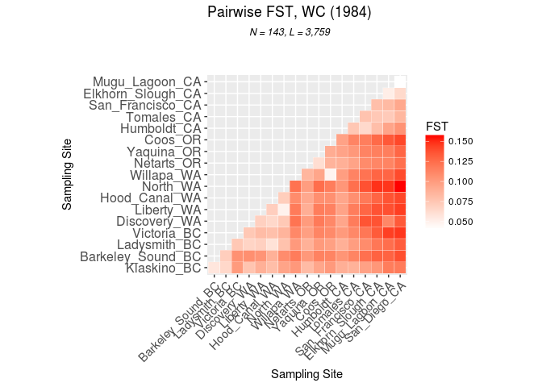

FST Heatmap
================
Katherine Silliman
April 24, 2017

This is an [R Markdown](http://rmarkdown.rstudio.com) Notebook. When you execute code within the notebook, the results appear beneath the code.

Try executing this chunk by clicking the *Run* button within the chunk or by placing your cursor inside it and pressing *Ctrl+Shift+Enter*.

``` r
library(hierfstat) #FST statistics
library("ggplot2") #plotting
library("reshape2") #plotting
library("adegenet") #FST statistics and data storage
```

    ## Loading required package: ade4

    ## 
    ##    /// adegenet 2.0.1 is loaded ////////////
    ## 
    ##    > overview: '?adegenet'
    ##    > tutorials/doc/questions: 'adegenetWeb()' 
    ##    > bug reports/feature requests: adegenetIssues()

    ## 
    ## Attaching package: 'adegenet'

    ## The following object is masked from 'package:hierfstat':
    ## 
    ##     read.fstat

Load in genind object previously generted with Adegenet. Chnging the strata to reflect desired regions.

``` r
load("m75x65.maf05.adegenet")
t.reg <- c(rep("Puget+",11),rep("NW_BC",19),rep("Puget+",9),rep("SoCal",8),rep("NoCal",2),"Oregon23",rep("NoCal",24),rep("SoCal",10),rep("Willapa_Coos",9),rep("Oregon23",7),"NoCal",rep("Oregon23",6),rep("Puget+",29),rep("Willapa_Coos",7))
strata(m75x65.maf05)$Region <- t.reg
```

Calculate pairwise fst for each pair of populations (Weir and Cockerham). Takes a while, so writes a file with the matrix.

``` r
m75maf05.fst <- pairwise.fst(m75x65.maf05, pop = strata(m75x65.maf05)$Population,res.type = "matrix")
m75maf05.fst.mat <- as.matrix(m75maf05.fst)
colnames(m75maf05.fst.mat) <- levels(strata(m75x65.maf05)$Population)
rownames(m75maf05.fst.mat) <- levels(strata(m75x65.maf05)$Population)
m75maf05.fst.mat
```

    ##                  Victoria   Klaskino Barkeley_Sound  Ladysmith  San_Diego
    ## Victoria       0.00000000 0.10079687     0.10621566 0.07483844 0.14647860
    ## Klaskino       0.10079687 0.00000000     0.05644646 0.06516504 0.11787716
    ## Barkeley_Sound 0.10621566 0.05644646     0.00000000 0.07122090 0.13827711
    ## Ladysmith      0.07483844 0.06516504     0.07122090 0.00000000 0.13253446
    ## San_Diego      0.14647860 0.11787716     0.13827711 0.13253446 0.00000000
    ## San_Francisco  0.11985317 0.09725787     0.12315374 0.10906865 0.09319769
    ## Netarts        0.09843465 0.08193708     0.10240123 0.08790792 0.12343145
    ## Tomales        0.11085514 0.08760396     0.11324949 0.09941795 0.08478767
    ## Elkhorn_Slough 0.13315360 0.10299517     0.12999324 0.11970470 0.06410411
    ## Humboldt       0.10125767 0.08912150     0.10406025 0.08846824 0.10487520
    ## Mugu_Lagoon    0.14411597 0.11658484     0.12945022 0.12433959 0.04170502
    ## Coos           0.11010384 0.10139230     0.11337034 0.09795978 0.14107355
    ## Yaquina        0.11281551 0.09442961     0.11429931 0.10121367 0.12806551
    ## Triton_Cove    0.07949534 0.08058643     0.08821763 0.05927621 0.14134790
    ## Liberty_Bay    0.08176580 0.08855278     0.10430281 0.06981182 0.14456356
    ## Discovery_Bay  0.07462843 0.07704283     0.10705227 0.06756968 0.13358943
    ## North_Bay      0.08621612 0.09569663     0.10858046 0.07822025 0.15589753
    ## Willapa        0.11094329 0.10201100     0.11739816 0.10147762 0.13985654
    ##                San_Francisco    Netarts    Tomales Elkhorn_Slough
    ## Victoria          0.11985317 0.09843465 0.11085514     0.13315360
    ## Klaskino          0.09725787 0.08193708 0.08760396     0.10299517
    ## Barkeley_Sound    0.12315374 0.10240123 0.11324949     0.12999324
    ## Ladysmith         0.10906865 0.08790792 0.09941795     0.11970470
    ## San_Diego         0.09319769 0.12343145 0.08478767     0.06410411
    ## San_Francisco     0.00000000 0.10947984 0.07752889     0.07990561
    ## Netarts           0.10947984 0.00000000 0.09631294     0.11203965
    ## Tomales           0.07752889 0.09631294 0.00000000     0.07430737
    ## Elkhorn_Slough    0.07990561 0.11203965 0.07430737     0.00000000
    ## Humboldt          0.06429813 0.08854004 0.07496437     0.08028067
    ## Mugu_Lagoon       0.08303614 0.11324934 0.07309901     0.05218199
    ## Coos              0.11633191 0.08668590 0.11302359     0.12643251
    ## Yaquina           0.11346806 0.06148527 0.10240100     0.11577725
    ## Triton_Cove       0.11874682 0.09304702 0.10692981     0.12860382
    ## Liberty_Bay       0.12797461 0.08970039 0.11666541     0.13683089
    ## Discovery_Bay     0.13614137 0.10074740 0.11732585     0.13662351
    ## North_Bay         0.13731495 0.09943637 0.12344791     0.14816967
    ## Willapa           0.12175310 0.08522312 0.11341609     0.12850416
    ##                  Humboldt Mugu_Lagoon       Coos    Yaquina Triton_Cove
    ## Victoria       0.10125767  0.14411597 0.11010384 0.11281551  0.07949534
    ## Klaskino       0.08912150  0.11658484 0.10139230 0.09442961  0.08058643
    ## Barkeley_Sound 0.10406025  0.12945022 0.11337034 0.11429931  0.08821763
    ## Ladysmith      0.08846824  0.12433959 0.09795978 0.10121367  0.05927621
    ## San_Diego      0.10487520  0.04170502 0.14107355 0.12806551  0.14134790
    ## San_Francisco  0.06429813  0.08303614 0.11633191 0.11346806  0.11874682
    ## Netarts        0.08854004  0.11324934 0.08668590 0.06148527  0.09304702
    ## Tomales        0.07496437  0.07309901 0.11302359 0.10240100  0.10692981
    ## Elkhorn_Slough 0.08028067  0.05218199 0.12643251 0.11577725  0.12860382
    ## Humboldt       0.00000000  0.09520873 0.09650440 0.09583764  0.09407787
    ## Mugu_Lagoon    0.09520873  0.00000000 0.13430679 0.11650848  0.13651142
    ## Coos           0.09650440  0.13430679 0.00000000 0.09088681  0.10673759
    ## Yaquina        0.09583764  0.11650848 0.09088681 0.00000000  0.10697672
    ## Triton_Cove    0.09407787  0.13651142 0.10673759 0.10697672  0.00000000
    ## Liberty_Bay    0.09624031  0.13807409 0.11448579 0.11661499  0.07081338
    ## Discovery_Bay  0.09435494  0.11144625 0.11118282 0.11830509  0.06496929
    ## North_Bay      0.10337575  0.14726393 0.11667376 0.12448128  0.07130441
    ## Willapa        0.09876441  0.12859900 0.04829341 0.09453541  0.10898657
    ##                Liberty_Bay Discovery_Bay  North_Bay    Willapa
    ## Victoria        0.08176580    0.07462843 0.08621612 0.11094329
    ## Klaskino        0.08855278    0.07704283 0.09569663 0.10201100
    ## Barkeley_Sound  0.10430281    0.10705227 0.10858046 0.11739816
    ## Ladysmith       0.06981182    0.06756968 0.07822025 0.10147762
    ## San_Diego       0.14456356    0.13358943 0.15589753 0.13985654
    ## San_Francisco   0.12797461    0.13614137 0.13731495 0.12175310
    ## Netarts         0.08970039    0.10074740 0.09943637 0.08522312
    ## Tomales         0.11666541    0.11732585 0.12344791 0.11341609
    ## Elkhorn_Slough  0.13683089    0.13662351 0.14816967 0.12850416
    ## Humboldt        0.09624031    0.09435494 0.10337575 0.09876441
    ## Mugu_Lagoon     0.13807409    0.11144625 0.14726393 0.12859900
    ## Coos            0.11448579    0.11118282 0.11667376 0.04829341
    ## Yaquina         0.11661499    0.11830509 0.12448128 0.09453541
    ## Triton_Cove     0.07081338    0.06496929 0.07130441 0.10898657
    ## Liberty_Bay     0.00000000    0.06986176 0.04958148 0.11769472
    ## Discovery_Bay   0.06986176    0.00000000 0.07406555 0.12159525
    ## North_Bay       0.04958148    0.07406555 0.00000000 0.12241461
    ## Willapa         0.11769472    0.12159525 0.12241461 0.00000000

``` r
write.table(m75maf05.fst.mat,file="FST/m75x65maf05.pwfst",row.names = T,col.names = T)
```

Renaming populations so they have the state in the name and rearranging them north to south.

``` r
colnames(m75maf05.fst.mat)<- c("Victoria_BC","Klaskino_BC","Barkeley_Sound_BC","Ladysmith_BC","San_Diego_CA","San_Francisco_CA","Netarts_OR","Tomales_CA","Elkhorn_Slough_CA","Humboldt_CA","Mugu_Lagoon_CA","Coos_OR","Yaquina_OR","Hood_Canal_WA","Liberty_WA","Discovery_WA","North_WA","Willapa_WA")
rownames(m75maf05.fst.mat)<- colnames(m75maf05.fst.mat)
#Rearranging North-South
N_S <- c("Klaskino_BC","Barkeley_Sound_BC","Ladysmith_BC","Victoria_BC","Discovery_WA","Liberty_WA","Hood_Canal_WA","North_WA","Willapa_WA","Netarts_OR","Yaquina_OR","Coos_OR", "Humboldt_CA","Tomales_CA","San_Francisco_CA","Elkhorn_Slough_CA","Mugu_Lagoon_CA","San_Diego_CA")
m75maf05.fst.mat <- m75maf05.fst.mat[N_S,N_S]
```

Setting up the matrix to be plotted by ggplot- probably a messy way to do it.

``` r
m75maf05.fst.mat.tri <- m75maf05.fst.mat
m75maf05.fst.mat.tri[lower.tri(m75maf05.fst.mat, diag=TRUE)] <- NA
#fst.mat = data.matrix(fst.df.tri)
melted <- melt(m75maf05.fst.mat.tri, na.rm =TRUE)
```

Plotting

``` r
ggplot(data = melted, aes(Var2, Var1, fill = value))+ geom_tile(color = "white")+ scale_fill_gradient(low = "white", high = "red", name="FST")  + ggtitle(expression(atop("Pairwise FST, WC (1984)", atop(italic("N = 143, L = 3,759"), ""))))+labs( x = "Sampling Site", y = "Sampling Site") + theme(axis.text.x = element_text(angle = 45, vjust = 1, size = 11, hjust = 1),axis.text.y = element_text(size = 12)) + coord_fixed()
```



Add a new chunk by clicking the *Insert Chunk* button on the toolbar or by pressing *Ctrl+Alt+I*.

When you save the notebook, an HTML file containing the code and output will be saved alongside it (click the *Preview* button or press *Ctrl+Shift+K* to preview the HTML file).
